# Mostafa

CS graduate and developer

---

## Skills

**Languages**

**Frameworks & Libraries**

**Tools & Platforms**

**Areas**

**Cloud**

---

## Projects

**Differential Privacy in Healthcare** — Dissertation  
Researched and implemented differential privacy mechanisms to enable secure, privacy-preserving analysis of sensitive medical data.

**[StockAnalyzer](https://github.com/ma2220/StockAnalyzer)**  
Python tool for analyzing and visualizing stock market data and trends.

**[HomeSpace](https://github.com/ma2220/HomeSpace-App)**  
Full-stack Home Management platform built with React and Node.js, featuring search, and user authentication.

---

## GitHub Metrics

